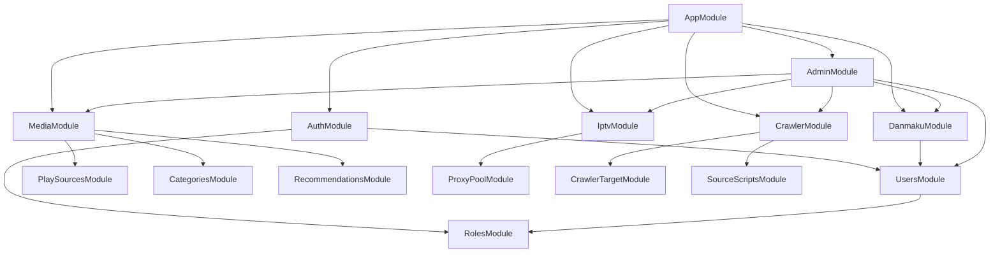

# Nest TV 后端架构设计文档

## 项目概述

Nest TV 是一个基于 NestJS 框架构建的视频流媒体平台后端，提供用户认证、媒体资源管理、多源播放、弹幕互动、IPTV 直播、爬虫采集、推荐系统等完整功能。

## 技术栈

- **框架**: NestJS v11.0.1
- **语言**: TypeScript
- **数据库**: MySQL (TypeORM)
- **缓存**: Redis (3个实例)
- **认证**: JWT + Local Passport 策略
- **实时通信**: Socket.IO (弹幕)
- **视频处理**: HLS.js, WebTorrent
- **爬虫**: Cheerio + Puppeteer
- **日志**: Winston

---

## 一、模块架构

### 1.1 核心模块 (26个模块)

```
AppModule (根模块)
├── 核心基础模块
│   ├── ConfigModule (全局配置)
│   ├── DatabaseModule (数据库连接)
│   ├── CacheModule (Redis缓存)
│   └── LoggerModule (日志系统)
│
├── 用户认证模块
│   ├── AuthModule (认证逻辑)
│   ├── UsersModule (用户管理)
│   └── RolesModule (角色权限)
│
├── 媒体内容模块
│   ├── MediaModule (媒体资源)
│   ├── PlaySourcesModule (播放源)
│   ├── CategoriesModule (分类管理)
│   └── RecommendationsModule (推荐系统)
│
├── 互动功能模块
│   ├── DanmakuModule (弹幕系统)
│   ├── WatchHistoryModule (观看历史)
│   ├── FavoritesModule (收藏管理)
│   └── CommentsModule (评论系统)
│
├── 直播流媒体模块
│   ├── IptvModule (IPTV直播)
│   ├── StreamModule (流媒体处理)
│   └── ProxyPoolModule (代理池)
│
├── 内容采集模块
│   ├── CrawlerModule (爬虫核心)
│   ├── CrawlerTargetModule (爬虫目标)
│   ├── SourceScriptsModule (源脚本)
│   └── ParseProvidersModule (解析提供商)
│
├── 下载功能模块
│   ├── TorrentModule (种子下载)
│   ├── DownloadTasksModule (下载任务)
│   └── WebDiskModule (网盘资源)
│
└── 扩展功能模块
    ├── AiChatModule (AI对话)
    ├── WatchRoomModule (观影房)
    ├── AdminModule (后台管理)
    └── SearchModule (搜索服务)
```

### 1.2 模块依赖关系



---

## 二、数据实体设计

### 2.1 核心实体 (15个实体)

#### 用户相关
- **User** - 用户基础信息
  - id, username, email, phone, password, nickname, avatar
  - role (关联 Role), isActive, lastLoginAt
  - recommendationSettings (JSON)

- **Role** - 角色定义
  - id, name, description, permissions (JSON)
  - isSystem (系统内置角色不可删)

#### 媒体资源
- **MediaResource** - 媒体资源主表
  - id, title, description, type (枚举: movie/tv_series/variety/anime/documentary)
  - director, actors, genres (JSON数组), releaseDate, quality
  - poster, backdrop, rating, viewCount, isActive
  - source, metadata (JSON), episodeCount, duration
  - playSources (关联 PlaySource[])

- **PlaySource** - 播放源
  - id, url, type (枚举: online/download/stream/third_party/magnet/iptv/webdisk/parser)
  - status (枚举: active/inactive/error/checking), resolution, format
  - priority, isAds, playCount, name, description, sourceName
  - headers (JSON), expireDate, isActive
  - mediaResourceId (关联 MediaResource)

- **Category** - 分类
  - id, name, slug, description, icon, parentId (自关联)
  - sortOrder, isActive

#### 用户行为
- **WatchHistory** - 观看历史
  - id, userId (关联 User), mediaResourceId (关联 MediaResource)
  - playSourceId, episodeNumber, watchProgress, lastWatchedAt
  - isCompleted, totalDuration

- **Favorite** - 收藏
  - id, userId, mediaResourceId, createdAt

- **Danmaku** - 弹幕
  - id, content, time, color, type (滚动/顶部/底部)
  - userId, mediaResourceId, playSourceId
  - fontSize, isApproved

#### 直播相关
- **IptvChannel** - IPTV频道
  - id, name, url, logo, group, country, language
  - resolution, isActive, epgId, tvgName

- **IptvEpg** - 节目单
  - id, channelId, title, startTime, endTime, description

#### 采集相关
- **CrawlerTarget** - 爬虫目标
  - id, name, baseUrl, parserScript, isActive
  - lastCrawlAt, crawlInterval, config (JSON)

- **SourceScript** - 源脚本
  - id, name, type, script, description
  - isActive, version, config (JSON)

#### 系统管理
- **AdminLog** - 管理日志
  - id, userId, action, target, details (JSON)
  - ip, userAgent

- **DownloadTask** - 下载任务
  - id, userId, url, type, status, progress
  - filePath, fileSize, metadata (JSON)

- **WatchRoom** - 观影房
  - id, name, hostId, currentMediaId, currentPlaySourceId
  - isPublic, maxUsers, password

### 2.2 实体关系图

```
User 1:N WatchHistory N:1 MediaResource
User 1:N Favorite N:1 MediaResource
User 1:N Danmaku
User N:1 Role

MediaResource 1:N PlaySource
MediaResource N:1 Category
MediaResource 1:N Danmaku

PlaySource 1:N WatchHistory
IptvChannel 1:N IptvEpg
```

---

## 三、服务层设计

### 3.1 认证服务 (AuthService)

**核心方法:**
- `register(dto: RegisterDto)` - 用户注册，bcrypt 密码加密
- `login(dto: LoginDto)` - 用户登录，返回 JWT token
- `validateUser(identifier, password)` - 验证用户凭据
- `refreshToken(token)` - 刷新访问令牌
- `getProfile(userId)` - 获取用户完整资料

**认证流程:**
```
注册: UserService.create → bcrypt.hash → User entity → JWT.sign
登录: LocalStrategy.validate → AuthService.login → JWT.sign
访问: JwtStrategy.validate → 附加 user 到 request
```

### 3.2 媒体资源服务 (MediaResourceService)

**核心方法:**
- `findAll(query: MediaQueryDto)` - 分页查询，支持类型/评分/排序筛选
- `findById(id)` - 获取详情，包含播放源（自动去重）
- `search(keyword)` - 全文搜索
- `getPopular(limit)` - 热门资源
- `getLatest(limit)` - 最新资源
- `getByCategory(categoryId)` - 按分类查询

**播放源去重逻辑:**
```typescript
// 按 URL 去重，保留优先级最高的
deduplicateByUrl(sources: PlaySource[]): PlaySource[] {
  const seen = new Set<string>();
  return sources.filter(s => {
    if (!s.url || seen.has(s.url)) return false;
    seen.add(s.url);
    return true;
  });
}
```

### 3.3 弹幕服务 (DanmakuService)

**核心方法:**
- `create(dto, userId)` - 发送弹幕（需审核）
- `getByMedia(mediaId, timeRange)` - 获取时间范围内弹幕
- `approve(id)` / `reject(id)` - 审核弹幕
- `batchDelete(ids)` - 批量删除

**WebSocket 事件:**
- `danmaku:send` - 发送弹幕
- `danmaku:receive` - 接收弹幕
- `danmaku:history` - 历史弹幕

### 3.4 IPTV 服务 (IptvService)

**核心方法:**
- `getChannels(query)` - 获取频道列表，支持分组筛选
- `getChannelById(id)` - 频道详情
- `getEpg(channelId)` - 获取节目单
- `proxyStream(url, res)` - 流代理（解决跨域）

**流代理关键实现:**
```typescript
// 解决 Express charset 问题
proxyStream(url: string, res: Response) {
  const response = await fetch(url);
  const buffer = await response.arrayBuffer();
  res.setHeader('Content-Type', 'application/vnd.apple.mpegurl');
  res.end(Buffer.from(buffer)); // 不使用 res.send() 避免 charset
}
```

### 3.5 爬虫服务 (CrawlerService)

**核心方法:**
- `crawl(targetName)` - 执行爬虫任务
- `parseDetail(url, script)` - 解析详情页
- `saveMedia(data)` - 保存到数据库
- `getTargets()` - 获取爬虫目标列表
- `testConnection(targetName)` - 测试连接

---

## 四、控制器与路由

### 4.1 API 路由结构

```
/api
├── /auth
│   POST /register          - 用户注册
│   POST /login             - 用户登录
│   POST /refresh           - 刷新令牌
│   GET  /profile           - 获取个人资料 [需认证]
│
├── /users
│   GET  /                  - 用户列表 [管理员]
│   GET  /:id               - 用户详情 [需认证]
│   PATCH /:id              - 更新用户 [需认证]
│   DELETE /:id             - 删除用户 [管理员]
│
├── /media
│   GET  /                  - 媒体列表 (分页、筛选)
│   GET  /popular           - 热门推荐
│   GET  /latest            - 最新更新
│   GET  /search            - 搜索
│   GET  /categories        - 分类列表
│   GET  /:id               - 媒体详情
│   GET  /:id/play-sources  - 播放源列表
│
├── /play-sources
│   GET  /                  - 播放源列表 [管理员]
│   POST /                  - 创建播放源 [管理员]
│   PATCH /:id              - 更新播放源 [管理员]
│   DELETE /:id             - 删除播放源 [管理员]
│
├── /danmaku
│   POST /                  - 发送弹幕 [需认证]
│   GET  /media/:id         - 获取弹幕
│   GET  /admin             - 管理列表 [管理员]
│   PATCH /:id/approve      - 审核通过 [管理员]
│   DELETE /:id             - 删除弹幕 [管理员]
│
├── /iptv
│   GET  /channels          - 频道列表
│   GET  /channels/:id      - 频道详情
│   GET  /epg/:id           - 节目单
│   GET  /stream/proxy      - 流代理
│   GET  /image/proxy       - 图片代理
│
├── /crawler
│   POST /trigger           - 触发爬虫 [管理员]
│   GET  /targets           - 目标列表 [管理员]
│   GET  /status            - 爬虫状态 [管理员]
│   POST /crawl-and-save    - 爬取并保存 [管理员]
│
├── /recommendations
│   GET  /                  - 个性化推荐 [需认证]
│   GET  /trending          - 趋势推荐
│   GET  /top-rated         - 高分推荐
│
├── /search
│   GET  /stream            - 流式搜索 (SSE)
│   GET  /suggestions       - 搜索建议
│   GET  /popular-keywords  - 热门关键词
│
├── /watch-history
│   GET  /                  - 观看历史 [需认证]
│   POST /                  - 记录观看 [需认证]
│   DELETE /:id             - 删除记录 [需认证]
│
├── /favorites
│   GET  /                  - 收藏列表 [需认证]
│   POST /                  - 添加收藏 [需认证]
│   DELETE /:id             - 取消收藏 [需认证]
│
├── /torrent
│   POST /add               - 添加种子 [需认证]
│   GET  /status/:id        - 下载状态 [需认证]
│   GET  /stream/:id        - 流式播放 [需认证]
│
└── /admin
    GET  /dashboard         - 仪表盘数据 [管理员]
    GET  /logs              - 操作日志 [管理员]
    GET  /users             - 用户管理 [管理员]
    GET  /media             - 媒体管理 [管理员]
    GET  /danmaku           - 弹幕管理 [管理员]
    GET  /system            - 系统信息 [管理员]
```

### 4.2 认证与授权

**守卫层次:**
```typescript
@Controller('media')
@UseGuards(JwtAuthGuard)  // 控制器级别
export class MediaController {
  @Get()
  findAll() { }  // 公开路由需用 @Public() 装饰器

  @Delete(':id')
  @Roles('admin')  // 角色限制
  remove() { }
}
```

**守卫类型:**
- `JwtAuthGuard` - JWT 令牌验证
- `RolesGuard` - 角色权限检查
- `ThrottlerGuard` - 请求限流

---

## 五、中间件与管道

### 5.1 全局中间件

- **CorsMiddleware** - CORS 跨域配置
- **LoggerMiddleware** - 请求日志记录
- **HelmetMiddleware** - 安全头设置
- **CompressionMiddleware** - 响应压缩

### 5.2 全局管道

- **ValidationPipe** - DTO 自动验证
- **ParseIntPipe** - 数字参数解析
- **ParseEnumPipe** - 枚举参数解析

### 5.3 异常过滤器

```typescript
@Catch(HttpException)
export class HttpExceptionFilter implements ExceptionFilter {
  catch(exception: HttpException, host: ArgumentsHost) {
    const response = host.switchToHttp().getResponse();
    const status = exception.getStatus();
    const message = exception.getResponse();

    response.status(status).json({
      success: false,
      statusCode: status,
      message: typeof message === 'string' ? message : message['message'],
      timestamp: new Date().toISOString(),
    });
  }
}
```

---

## 六、配置管理

### 6.1 环境变量配置

```typescript
// .env 配置项
DATABASE_HOST=localhost
DATABASE_PORT=3306
DATABASE_USERNAME=root
DATABASE_PASSWORD=***
DATABASE_NAME=nest_tv

REDIS_HOST=localhost
REDIS_PORT=6379
REDIS_PASSWORD=***

JWT_SECRET=***
JWT_EXPIRES_IN=7d

AI_API_KEY=***
AI_API_URL=***
```

### 6.2 配置模块结构

```typescript
@Module({
  imports: [
    ConfigModule.forRoot({
      isGlobal: true,
      envFilePath: ['.env', '.env.production'],
      validate: validateConfig,
    }),
  ],
})
export class AppModule {}
```

---

## 七、第三方集成

### 7.1 核心依赖

| 依赖 | 版本 | 用途 |
|------|------|------|
| @nestjs/core | 11.0.1 | 框架核心 |
| @nestjs/typeorm | ^11.0.0 | ORM |
| @nestjs/jwt | ^11.0.0 | JWT 认证 |
| @nestjs/passport | ^11.0.0 | 认证策略 |
| @nestjs/platform-socket.io | ^11.0.0 | WebSocket |
| @nestjs/schedule | ^6.0.0 | 定时任务 |
| typeorm | ^0.3.24 | 数据库 ORM |
| ioredis | ^5.6.1 | Redis 客户端 |
| cheerio | ^1.0.0 | HTML 解析 |
| puppeteer | ^24.7.2 | 无头浏览器 |
| webtorrent | ^2.5.1 | 种子下载 |
| winston | ^3.17.0 | 日志系统 |
| bcrypt | ^5.1.1 | 密码加密 |
| class-validator | ^0.14.2 | DTO 验证 |
| class-transformer | ^0.5.1 | 对象转换 |

### 7.2 缓存策略

```typescript
// Redis 缓存配置
CacheModule.registerAsync({
  useFactory: (configService: ConfigService) => ({
    store: 'redis',
    host: configService.get('REDIS_HOST'),
    port: configService.get('REDIS_PORT'),
    ttl: 60 * 60, // 1小时默认 TTL
  }),
  inject: [ConfigService],
})
```

---

## 八、特殊功能模块

### 8.1 推荐系统

**推荐算法:**
- 基于用户观看历史的内容相似度推荐
- 基于热门度的全局推荐
- 基于用户偏好的个性化推荐
- 支持排除特定类型/分类

### 8.2 弹幕系统

**实时通信架构:**
```
Client → WebSocket → DanmakuGateway → DanmakuService → Database
                  ↓
           广播给同房间用户
```

**弹幕类型:**
- 滚动弹幕 (scroll)
- 顶部弹幕 (top)
- 底部弹幕 (bottom)

### 8.3 代理池

**功能:**
- 动态代理 IP 管理
- 自动验证代理可用性
- 按响应速度排序
- 失败自动切换

### 8.4 观影房

**功能:**
- 多人同步观影
- 房主控制播放进度
- 房间内聊天
- 支持密码房间

### 8.5 AI 对话

**实现:**
- SSE (Server-Sent Events) 流式响应
- 支持多轮对话上下文
- 可配置 AI 模型和参数

---

## 九、数据库设计原则

### 9.1 索引策略

```sql
-- 常用查询索引
CREATE INDEX idx_media_type ON media_resource(type);
CREATE INDEX idx_media_rating ON media_resource(rating DESC);
CREATE INDEX idx_media_created ON media_resource(created_at DESC);
CREATE INDEX idx_play_source_media ON play_source(media_resource_id);
CREATE INDEX idx_watch_history_user ON watch_history(user_id);
CREATE INDEX idx_danmaku_media ON danmaku(media_resource_id, time);
```

### 9.2 数据一致性

- 使用事务处理关联操作
- 软删除 (isActive 标记)
- 定期清理过期数据

---

## 十、性能优化

### 10.1 缓存策略

- 热门数据 Redis 缓存
- 查询结果内存缓存
- CDN 静态资源缓存

### 10.2 数据库优化

- 分页查询避免全表扫描
- 批量操作减少数据库往返
- 连接池配置优化

### 10.3 并发处理

- 请求限流 (ThrottlerGuard)
- 异步任务队列
- WebSocket 连接池管理

---

## 十一、安全设计

### 11.1 认证安全

- JWT 令牌过期机制
- 密码 bcrypt 加密
- 登录失败限制

### 11.2 数据安全

- SQL 注入防护 (TypeORM 参数化查询)
- XSS 防护 (输入验证)
- CSRF 防护

### 11.3 接口安全

- 请求限流
- 敏感操作日志记录
- 管理员权限分离

---

## 十二、部署架构

### 12.1 开发环境

```bash
npm run start:dev  # 热重载开发
```

### 12.2 生产环境

```bash
npm run build      # 编译
npm run start:prod # 生产启动
```

### 12.3 Docker 部署

```yaml
# docker-compose.yml
services:
  backend:
    build: ./backend
    ports: ["3334:3334"]
    depends_on: [mysql, redis]

  mysql:
    image: mysql:8.0
    volumes: [mysql_data:/var/lib/mysql]

  redis:
    image: redis:7-alpine
```

---

## 十三、监控与日志

### 13.1 日志级别

- error: 错误日志
- warn: 警告日志
- info: 信息日志
- debug: 调试日志

### 13.2 监控指标

- API 响应时间
- 数据库查询性能
- Redis 缓存命中率
- WebSocket 连接数

---

## 十四、扩展性设计

### 14.1 模块化扩展

- 新功能通过 Module 添加
- 服务间通过依赖注入解耦
- 支持插件式源脚本

### 14.2 水平扩展

- 无状态服务设计
- Redis 共享会话
- 负载均衡支持

---

*文档版本: v1.0*
*最后更新: 2026-05-18*
