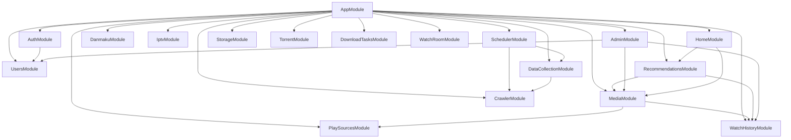
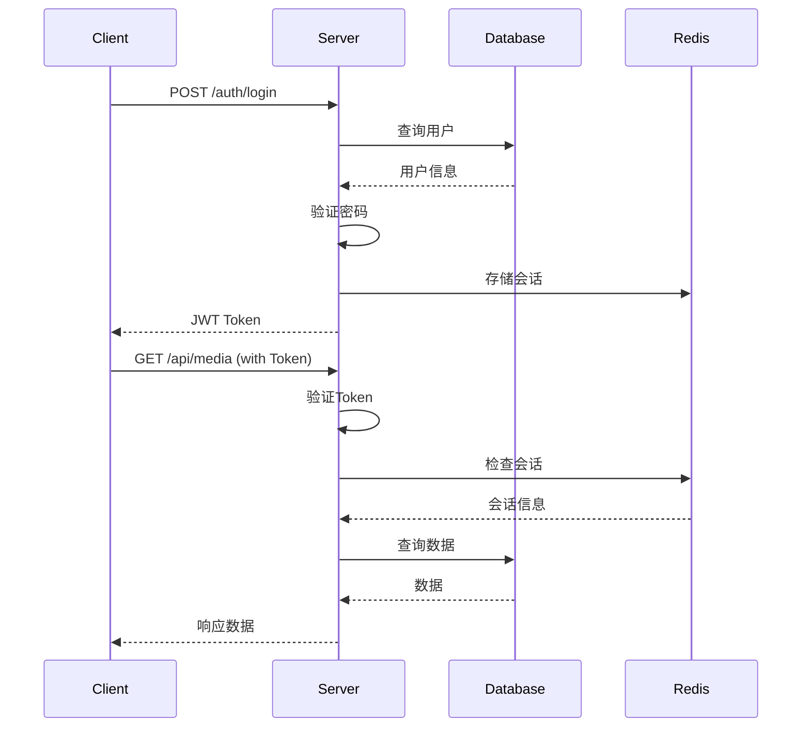

# NestTV 全面优化架构设计文档

## 一、架构概述

### 1.1 系统架构图

```
┌─────────────────────────────────────────────────────────────┐
│                        用户层 (Client)                       │
├─────────────────────────────────────────────────────────────┤
│  ┌─────────────┐  ┌─────────────┐  ┌─────────────┐         │
│  │   Web App   │  │  Mobile Web │  │   Admin UI  │         │
│  │  (Vue 3)    │  │  (Vue 3)    │  │  (Vue 3)    │         │
│  └──────┬──────┘  └──────┬──────┘  └──────┬──────┘         │
│         │                │                │                 │
│         └────────────────┼────────────────┘                 │
│                          │                                  │
│                    ┌─────▼─────┐                           │
│                    │   Nginx   │                           │
│                    │  (反向代理) │                           │
│                    └─────┬─────┘                           │
└──────────────────────────┼──────────────────────────────────┘
                           │
┌──────────────────────────┼──────────────────────────────────┐
│                    应用层 (Application)                       │
│                          │                                  │
│         ┌────────────────┼────────────────┐                 │
│         │                │                │                 │
│   ┌─────▼─────┐   ┌─────▼─────┐   ┌─────▼─────┐          │
│   │  API层    │   │ WebSocket │   │  静态资源  │          │
│   │ (NestJS)  │   │ (Socket.io)│   │  服务器   │          │
│   └─────┬─────┘   └─────┬─────┘   └───────────┘          │
│         │                │                                 │
│   ┌─────▼────────────────▼─────┐                          │
│   │        业务服务层           │                          │
│   │  ┌─────┐ ┌─────┐ ┌─────┐  │                          │
│   │  │媒体 │ │用户 │ │播放 │  │                          │
│   │  │服务 │ │服务 │ │服务 │  │                          │
│   │  └─────┘ └─────┘ └─────┘  │                          │
│   │  ┌─────┐ ┌─────┐ ┌─────┐  │                          │
│   │  │爬虫 │ │推荐 │ │管理 │  │                          │
│   │  │服务 │ │服务 │ │服务 │  │                          │
│   │  └─────┘ └─────┘ └─────┘  │                          │
│   └─────────────┬─────────────┘                          │
│                 │                                         │
└─────────────────┼──────────────────────────────────────────┘
                  │
┌─────────────────┼──────────────────────────────────────────┐
│              数据层 (Data)                                  │
│                 │                                         │
│   ┌─────────────┼─────────────┐                          │
│   │             │             │                          │
│ ┌─▼─────┐   ┌──▼───┐   ┌────▼────┐                     │
│ │ MySQL │   │Redis │   │ 文件存储 │                     │
│ │(主数据库)│  │(缓存) │   │(视频/图片)│                     │
│ └───────┘   └──────┘   └─────────┘                     │
│                                                         │
└─────────────────────────────────────────────────────────┘
```

### 1.2 技术栈选型

| 层级 | 技术 | 版本 | 选型理由 |
|------|------|------|----------|
| **前端框架** | Vue 3 | 3.4+ | 组合式API、TypeScript支持、生态成熟 |
| **构建工具** | Vite | 5.0+ | 快速热更新、原生ESM支持 |
| **状态管理** | Pinia | 2.1+ | 轻量级、TypeScript友好、DevTools支持 |
| **CSS框架** | UnoCSS | 0.58+ | 原子化CSS、高性能、灵活配置 |
| **播放器** | ArtPlayer | 5.4+ | 功能丰富、插件生态、移动端友好 |
| **HTTP客户端** | Axios | 1.6+ | 拦截器、请求取消、错误处理 |
| **后端框架** | NestJS | 11.0+ | 企业级架构、TypeScript原生支持 |
| **ORM** | TypeORM | 0.3+ | 装饰器语法、迁移支持、关系映射 |
| **数据库** | MySQL | 8.0+ | 成熟稳定、性能优秀、社区支持 |
| **缓存** | Redis | 6.0+ | 高性能、数据结构丰富、持久化 |
| **实时通信** | Socket.io | 4.8+ | 自动重连、房间支持、二进制支持 |
| **日志** | Winston | 3.17+ | 多传输、日志级别、格式化 |

---

## 二、前端架构

### 2.1 目录结构

```
frontend/src/
├── api/                    # API接口定义
│   ├── index.ts           # API客户端配置
│   ├── auth.ts            # 认证相关API
│   ├── media.ts           # 媒体资源API
│   ├── playSource.ts      # 播放源API
│   └── ...
├── assets/                 # 静态资源
│   ├── images/            # 图片资源
│   └── fonts/             # 字体资源
├── components/             # 公共组件
│   ├── common/            # 通用组件
│   ├── media/             # 媒体相关组件
│   ├── player/            # 播放器组件
│   └── layout/            # 布局组件
├── composables/            # 组合式函数
│   ├── useAuth.ts         # 认证相关
│   ├── usePlayer.ts       # 播放器相关
│   ├── useSearch.ts       # 搜索相关
│   └── ...
├── i18n/                   # 国际化
│   ├── locales/           # 语言包
│   └── index.ts           # i18n配置
├── layouts/                # 布局组件
│   ├── AdminLayout.vue    # 管理后台布局
│   ├── MainLayout.vue     # 主布局
│   └── ...
├── router/                 # 路由配置
│   ├── index.ts           # 路由入口
│   ├── guards.ts          # 路由守卫
│   └── modules/           # 路由模块
├── services/               # 服务层
│   ├── storage.ts         # 本地存储服务
│   ├── cache.ts           # 缓存服务
│   └── ...
├── stores/                 # Pinia状态管理
│   ├── auth.ts            # 认证状态
│   ├── media.ts           # 媒体状态
│   ├── player.ts          # 播放器状态
│   └── ...
├── styles/                 # 样式文件
│   ├── variables.css      # CSS变量
│   ├── global.css         # 全局样式
│   └── ...
├── types/                  # TypeScript类型
│   ├── index.ts           # 类型导出
│   ├── api.ts             # API类型
│   ├── media.ts           # 媒体类型
│   └── ...
├── utils/                  # 工具函数
│   ├── format.ts          # 格式化工具
│   ├── validation.ts      # 验证工具
│   ├── helper.ts          # 辅助函数
│   └── ...
├── views/                  # 页面组件
│   ├── HomeView.vue       # 首页
│   ├── MediaDetailView.vue # 详情页
│   ├── WatchView.vue      # 播放页
│   ├── SearchView.vue     # 搜索页
│   ├── admin/             # 管理页面
│   └── ...
├── App.vue                 # 根组件
└── main.ts                 # 入口文件
```

### 2.2 状态管理架构

```typescript
// stores/index.ts - 状态管理入口
export const useAuthStore = defineStore('auth', {
  state: () => ({
    user: null,
    token: null,
    isAuthenticated: false
  }),
  getters: {
    isAdmin: (state) => state.user?.role === 'admin'
  },
  actions: {
    async login(credentials) { ... },
    async logout() { ... },
    async fetchProfile() { ... }
  }
})

export const useMediaStore = defineStore('media', {
  state: () => ({
    currentMedia: null,
    mediaList: [],
    searchResults: [],
    recommendations: []
  }),
  actions: {
    async fetchMedia(id) { ... },
    async searchMedia(query) { ... },
    async fetchRecommendations() { ... }
  }
})

export const usePlayerStore = defineStore('player', {
  state: () => ({
    currentSource: null,
    currentTime: 0,
    isPlaying: false,
    volume: 1,
    playbackRate: 1,
    isPiP: false
  }),
  actions: {
    setSource(source) { ... },
    seek(time) { ... },
    togglePiP() { ... }
  }
})
```

### 2.3 路由架构

```typescript
// router/index.ts - 路由配置
const routes: RouteRecordRaw[] = [
  {
    path: '/',
    component: MainLayout,
    children: [
      { path: '', name: 'Home', component: () => import('@/views/HomeView.vue') },
      { path: 'search', name: 'Search', component: () => import('@/views/SearchView.vue') },
      { path: 'media/:id', name: 'MediaDetail', component: () => import('@/views/MediaDetailView.vue') },
      { path: 'watch/:id', name: 'Watch', component: () => import('@/views/WatchView.vue') },
      { path: 'favorites', name: 'Favorites', component: () => import('@/views/FavoritesView.vue') },
      { path: 'history', name: 'History', component: () => import('@/views/HistoryView.vue') },
      { path: 'profile', name: 'Profile', component: () => import('@/views/ProfileView.vue') }
    ]
  },
  {
    path: '/admin',
    component: AdminLayout,
    meta: { requiresAdmin: true },
    children: [
      { path: '', name: 'AdminDashboard', component: () => import('@/views/admin/DashboardView.vue') },
      { path: 'media', name: 'AdminMedia', component: () => import('@/views/admin/MediaView.vue') },
      { path: 'users', name: 'AdminUsers', component: () => import('@/views/admin/UsersView.vue') },
      { path: 'sources', name: 'AdminSources', component: () => import('@/views/admin/SourcesView.vue') },
      { path: 'crawler', name: 'AdminCrawler', component: () => import('@/views/admin/CrawlerView.vue') },
      { path: 'logs', name: 'AdminLogs', component: () => import('@/views/admin/LogsView.vue') }
    ]
  },
  {
    path: '/auth',
    children: [
      { path: 'login', name: 'Login', component: () => import('@/views/auth/LoginView.vue') },
      { path: 'register', name: 'Register', component: () => import('@/views/auth/RegisterView.vue') }
    ]
  }
]
```

### 2.4 组件设计原则

1. **单一职责**：每个组件只做一件事
2. **可复用性**：通过Props和Slots实现灵活配置
3. **类型安全**：完整的TypeScript类型定义
4. **性能优化**：合理使用computed和watch
5. **可测试性**：组件逻辑清晰，便于单元测试

---

## 三、后端架构

### 3.1 目录结构

```
backend/src/
├── admin/                  # 管理后台模块
│   ├── admin.controller.ts
│   ├── admin.service.ts
│   └── admin.module.ts
├── auth/                   # 认证模块
│   ├── auth.controller.ts
│   ├── auth.service.ts
│   ├── strategies/        # 认证策略
│   ├── guards/            # 认证守卫
│   └── auth.module.ts
├── common/                 # 公共模块
│   ├── decorators/        # 自定义装饰器
│   ├── filters/           # 异常过滤器
│   ├── guards/            # 公共守卫
│   ├── interceptors/      # 拦截器
│   ├── middleware/        # 中间件
│   ├── pipes/             # 管道
│   └── services/          # 公共服务
├── config/                 # 配置模块
│   ├── database.config.ts
│   ├── redis.config.ts
│   ├── jwt.config.ts
│   └── ...
├── crawler/                # 爬虫模块
│   ├── crawler.controller.ts
│   ├── crawler.service.ts
│   ├── parsers/           # 页面解析器
│   └── crawler.module.ts
├── danmaku/                # 弹幕模块
│   ├── danmaku.controller.ts
│   ├── danmaku.service.ts
│   └── danmaku.module.ts
├── data-collection/        # 数据采集模块
│   ├── data-collection.controller.ts
│   ├── data-collection.service.ts
│   └── data-collection.module.ts
├── download-tasks/         # 下载任务模块
│   ├── download-tasks.controller.ts
│   ├── download-tasks.service.ts
│   └── download-tasks.module.ts
├── entities/               # 数据实体
│   ├── user.entity.ts
│   ├── media-resource.entity.ts
│   ├── play-source.entity.ts
│   ├── watch-history.entity.ts
│   └── ...
├── home/                   # 首页模块
│   ├── home.controller.ts
│   ├── home.service.ts
│   └── home.module.ts
├── iptv/                   # IPTV模块
│   ├── iptv.controller.ts
│   ├── iptv.service.ts
│   └── iptv.module.ts
├── media/                  # 媒体资源模块
│   ├── media-resource.controller.ts
│   ├── media-resource.service.ts
│   ├── advanced-search.controller.ts
│   ├── advanced-search.service.ts
│   └── media.module.ts
├── middleware/              # 中间件
│   ├── request-logging.middleware.ts
│   ├── performance-monitoring.middleware.ts
│   └── rate-limit.middleware.ts
├── play-sources/           # 播放源模块
│   ├── play-source.controller.ts
│   ├── play-source.service.ts
│   └── play-source.module.ts
├── recommendations/        # 推荐模块
│   ├── recommendation.controller.ts
│   ├── recommendation.service.ts
│   └── recommendation.module.ts
├── redis/                  # Redis模块
│   ├── redis.module.ts
│   └── redis.service.ts
├── scheduler/              # 调度模块
│   ├── scheduler.controller.ts
│   ├── scheduler.service.ts
│   └── scheduler.module.ts
├── storage/                # 存储模块
│   ├── storage.controller.ts
│   ├── storage.service.ts
│   └── storage.module.ts
├── torrent/                # 种子模块
│   ├── torrent.controller.ts
│   ├── torrent.service.ts
│   └── torrent.module.ts
├── users/                  # 用户模块
│   ├── users.controller.ts
│   ├── users.service.ts
│   └── users.module.ts
├── watch-history/          # 观看历史模块
│   ├── watch-history.controller.ts
│   ├── watch-history.service.ts
│   └── watch-history.module.ts
├── watch-room/             # 观影室模块
│   ├── watch-room.controller.ts
│   ├── watch-room.service.ts
│   └── watch-room.module.ts
├── app.module.ts           # 根模块
└── main.ts                 # 入口文件
```

### 3.2 模块依赖关系



### 3.3 数据库设计

#### 核心实体关系

```sql
-- 用户表
CREATE TABLE users (
    id VARCHAR(36) PRIMARY KEY,
    username VARCHAR(50) UNIQUE NOT NULL,
    email VARCHAR(100) UNIQUE NOT NULL,
    password VARCHAR(255) NOT NULL,
    role ENUM('user', 'admin', 'superAdmin') DEFAULT 'user',
    avatar VARCHAR(255),
    settings JSON,
    created_at TIMESTAMP DEFAULT CURRENT_TIMESTAMP,
    updated_at TIMESTAMP DEFAULT CURRENT_TIMESTAMP ON UPDATE CURRENT_TIMESTAMP
);

-- 媒体资源表
CREATE TABLE media_resources (
    id VARCHAR(36) PRIMARY KEY,
    title VARCHAR(255) NOT NULL,
    type ENUM('movie', 'tv', 'variety', 'anime', 'documentary') NOT NULL,
    description TEXT,
    poster VARCHAR(255),
    backdrop VARCHAR(255),
    rating DECIMAL(3,1),
    release_date DATE,
    genres JSON,
    directors JSON,
    actors JSON,
    duration INT,
    status ENUM('ongoing', 'completed') DEFAULT 'completed',
    created_at TIMESTAMP DEFAULT CURRENT_TIMESTAMP,
    updated_at TIMESTAMP DEFAULT CURRENT_TIMESTAMP ON UPDATE CURRENT_TIMESTAMP,
    INDEX idx_type (type),
    INDEX idx_rating (rating),
    INDEX idx_release_date (release_date)
);

-- 播放源表
CREATE TABLE play_sources (
    id VARCHAR(36) PRIMARY KEY,
    media_id VARCHAR(36) NOT NULL,
    source_name VARCHAR(100) NOT NULL,
    source_url VARCHAR(500) NOT NULL,
    quality ENUM('sd', 'hd', 'fhd', '4k') DEFAULT 'hd',
    type ENUM('direct', 'hls', 'magnet', 'torrent') NOT NULL,
    status ENUM('active', 'inactive', 'checking') DEFAULT 'active',
    priority INT DEFAULT 0,
    metadata JSON,
    created_at TIMESTAMP DEFAULT CURRENT_TIMESTAMP,
    updated_at TIMESTAMP DEFAULT CURRENT_TIMESTAMP ON UPDATE CURRENT_TIMESTAMP,
    FOREIGN KEY (media_id) REFERENCES media_resources(id) ON DELETE CASCADE,
    INDEX idx_media_id (media_id),
    INDEX idx_quality (quality),
    INDEX idx_status (status)
);

-- 观看历史表
CREATE TABLE watch_history (
    id VARCHAR(36) PRIMARY KEY,
    user_id VARCHAR(36) NOT NULL,
    media_id VARCHAR(36) NOT NULL,
    source_id VARCHAR(36),
    current_time DECIMAL(10,2) DEFAULT 0,
    duration DECIMAL(10,2) DEFAULT 0,
    progress DECIMAL(5,2) DEFAULT 0,
    is_completed BOOLEAN DEFAULT FALSE,
    last_watched_at TIMESTAMP DEFAULT CURRENT_TIMESTAMP,
    created_at TIMESTAMP DEFAULT CURRENT_TIMESTAMP,
    updated_at TIMESTAMP DEFAULT CURRENT_TIMESTAMP ON UPDATE CURRENT_TIMESTAMP,
    FOREIGN KEY (user_id) REFERENCES users(id) ON DELETE CASCADE,
    FOREIGN KEY (media_id) REFERENCES media_resources(id) ON DELETE CASCADE,
    INDEX idx_user_id (user_id),
    INDEX idx_media_id (media_id),
    INDEX idx_last_watched (last_watched_at)
);

-- 收藏表
CREATE TABLE favorites (
    id VARCHAR(36) PRIMARY KEY,
    user_id VARCHAR(36) NOT NULL,
    media_id VARCHAR(36) NOT NULL,
    created_at TIMESTAMP DEFAULT CURRENT_TIMESTAMP,
    FOREIGN KEY (user_id) REFERENCES users(id) ON DELETE CASCADE,
    FOREIGN KEY (media_id) REFERENCES media_resources(id) ON DELETE CASCADE,
    UNIQUE KEY uk_user_media (user_id, media_id),
    INDEX idx_user_id (user_id)
);

-- 搜索历史表
CREATE TABLE search_history (
    id VARCHAR(36) PRIMARY KEY,
    user_id VARCHAR(36),
    keyword VARCHAR(255) NOT NULL,
    results_count INT DEFAULT 0,
    created_at TIMESTAMP DEFAULT CURRENT_TIMESTAMP,
    FOREIGN KEY (user_id) REFERENCES users(id) ON DELETE SET NULL,
    INDEX idx_user_id (user_id),
    INDEX idx_keyword (keyword),
    INDEX idx_created_at (created_at)
);
```

### 3.4 API设计规范

#### RESTful API规范

```typescript
// 统一响应格式
interface ApiResponse<T> {
  code: number;        // 状态码
  message: string;     // 消息
  data: T;            // 数据
  timestamp: number;   // 时间戳
}

// 分页响应格式
interface PaginatedResponse<T> {
  items: T[];          // 数据列表
  total: number;       // 总数
  page: number;        // 当前页
  limit: number;       // 每页数量
  totalPages: number;  // 总页数
}

// 错误响应格式
interface ErrorResponse {
  code: number;        // 错误码
  message: string;     // 错误消息
  errors?: any[];      // 详细错误
  timestamp: number;   // 时间戳
}
```

#### API路由规范

```
GET    /api/media                    # 获取媒体列表
GET    /api/media/:id                # 获取媒体详情
POST   /api/media                    # 创建媒体（管理员）
PUT    /api/media/:id                # 更新媒体（管理员）
DELETE /api/media/:id                # 删除媒体（管理员）

GET    /api/media/:id/sources        # 获取播放源列表
POST   /api/media/:id/sources        # 添加播放源（管理员）
PUT    /api/sources/:id              # 更新播放源（管理员）
DELETE /api/sources/:id              # 删除播放源（管理员）

GET    /api/search                   # 搜索媒体
GET    /api/search/suggestions       # 获取搜索建议
GET    /api/search/popular           # 获取热门搜索

GET    /api/recommendations          # 获取推荐
GET    /api/recommendations/personalized # 获取个性化推荐

POST   /api/auth/register            # 用户注册
POST   /api/auth/login               # 用户登录
POST   /api/auth/logout              # 用户登出
GET    /api/auth/profile             # 获取用户信息

GET    /api/user/history             # 获取观看历史
POST   /api/user/history             # 记录观看历史
GET    /api/user/favorites           # 获取收藏列表
POST   /api/user/favorites           # 添加收藏
DELETE /api/user/favorites/:id       # 删除收藏

GET    /api/admin/users              # 获取用户列表（管理员）
GET    /api/admin/media              # 获取媒体列表（管理员）
GET    /api/admin/logs               # 获取系统日志（管理员）
GET    /api/admin/stats              # 获取统计数据（管理员）
```

---

## 四、缓存架构

### 4.1 缓存策略

```typescript
// 缓存配置
const cacheConfig = {
  // 媒体详情缓存
  media: {
    ttl: 3600,        // 1小时
    prefix: 'media:',
    key: (id: string) => `media:${id}`
  },
  
  // 搜索结果缓存
  search: {
    ttl: 300,         // 5分钟
    prefix: 'search:',
    key: (query: string) => `search:${query}`
  },
  
  // 推荐缓存
  recommendations: {
    ttl: 1800,        // 30分钟
    prefix: 'recommend:',
    key: (userId: string) => `recommend:${userId}`
  },
  
  // 用户会话缓存
  session: {
    ttl: 86400,       // 24小时
    prefix: 'session:',
    key: (token: string) => `session:${token}`
  }
}
```

### 4.2 缓存更新策略

1. **Cache-Aside（旁路缓存）**
   - 读取：先查缓存，缓存未命中查数据库，写入缓存
   - 写入：更新数据库，删除缓存
   - 适用：媒体详情、用户信息

2. **Write-Through（直写缓存）**
   - 写入：同时写入缓存和数据库
   - 适用：配置信息、系统设置

3. **Write-Behind（异步写入）**
   - 写入：先写入缓存，异步写入数据库
   - 适用：观看历史、统计数据

---

## 五、安全架构

### 5.1 认证流程



### 5.2 安全措施

1. **认证安全**
   - JWT Token认证
   - Token过期机制（24小时）
   - Refresh Token机制
   - 登录失败锁定（5次失败锁定30分钟）

2. **数据安全**
   - 密码bcrypt加密
   - 敏感数据加密存储
   - SQL注入防护（TypeORM参数化查询）
   - XSS防护（输入验证、输出编码）

3. **传输安全**
   - HTTPS强制启用
   - CORS配置
   - 请求签名验证
   - 防重放攻击

4. **访问控制**
   - 基于角色的访问控制（RBAC）
   - API权限验证
   - 资源权限检查
   - 操作日志记录

---

## 六、性能优化架构

### 6.1 前端性能优化

```typescript
// 1. 路由懒加载
const routes = [
  {
    path: '/media/:id',
    component: () => import('@/views/MediaDetailView.vue')
  }
]

// 2. 组件懒加载
const HeavyComponent = defineAsyncComponent(() =>
  import('@/components/HeavyComponent.vue')
)

// 3. 图片懒加载


// 4. 虚拟滚动
<VirtualScroller :items="list" :item-height="100">
  <template #default="{ item }">
    <ItemCard :item="item" />
  </template>
</VirtualScroller>

// 5. 防抖搜索
const debouncedSearch = useDebounce(search, 300)

// 6. 缓存策略
const cachedFetch = (url: string) => {
  const cached = localStorage.getItem(url)
  if (cached) return JSON.parse(cached)
  
  return fetch(url).then(res => {
    localStorage.setItem(url, JSON.stringify(res))
    return res
  })
}
```

### 6.2 后端性能优化

```typescript
// 1. Redis缓存
@Injectable()
export class MediaService {
  constructor(
    @Inject(CACHE_MANAGER) private cacheManager: Cache
  ) {}
  
  async getMedia(id: string): Promise<MediaResource> {
    const cacheKey = `media:${id}`
    const cached = await this.cacheManager.get<MediaResource>(cacheKey)
    
    if (cached) return cached
    
    const media = await this.mediaRepository.findOne({ where: { id } })
    await this.cacheManager.set(cacheKey, media, 3600)
    
    return media
  }
}

// 2. 数据库索引
@Entity()
export class MediaResource {
  @Index()
  @Column()
  type: string;
  
  @Index()
  @Column()
  rating: number;
  
  @Index()
  @Column()
  createdAt: Date;
}

// 3. 响应压缩
app.use(compression({
  level: 6,
  threshold: 1024
}))

// 4. 请求限流
@Injectable()
export class RateLimitGuard implements CanActivate {
  async canActivate(context: ExecutionContext): Promise<boolean> {
    const request = context.switchToHttp().getRequest()
    const key = `rate:${request.ip}`
    const current = await this.redisService.get(key)
    
    if (current > 100) {
      throw new HttpException('Too Many Requests', 429)
    }
    
    await this.redisService.incr(key)
    await this.redisService.expire(key, 60)
    
    return true
  }
}
```

---

## 七、监控与日志架构

### 7.1 日志系统

```typescript
// 日志配置
const logger = createLogger({
  level: 'info',
  format: format.combine(
    format.timestamp(),
    format.json()
  ),
  transports: [
    new transports.Console(),
    new transports.File({ filename: 'logs/error.log', level: 'error' }),
    new transports.File({ filename: 'logs/combined.log' })
  ]
})

// 日志中间件
@Injectable()
export class RequestLoggingMiddleware implements NestMiddleware {
  use(req: Request, res: Response, next: NextFunction) {
    const start = Date.now()
    
    res.on('finish', () => {
      const duration = Date.now() - start
      logger.info({
        method: req.method,
        url: req.url,
        status: res.statusCode,
        duration,
        userAgent: req.get('user-agent'),
        ip: req.ip
      })
    })
    
    next()
  }
}
```

### 7.2 性能监控

```typescript
// 性能监控中间件
@Injectable()
export class PerformanceMonitoringMiddleware implements NestMiddleware {
  use(req: Request, res: Response, next: NextFunction) {
    const start = process.hrtime()
    
    res.on('finish', () => {
      const [seconds, nanoseconds] = process.hrtime(start)
      const duration = seconds * 1000 + nanoseconds / 1000000
      
      // 记录慢请求
      if (duration > 1000) {
        logger.warn({
          type: 'slow_request',
          method: req.method,
          url: req.url,
          duration
        })
      }
      
      // 记录性能指标
      metrics.recordRequestDuration(duration)
    })
    
    next()
  }
}
```

---

## 八、部署架构

### 8.1 Docker部署

```yaml
# docker-compose.yml
version: '3.8'

services:
  frontend:
    build:
      context: ./frontend
      dockerfile: Dockerfile
    ports:
      - "80:80"
    depends_on:
      - backend
    networks:
      - nesttv-network

  backend:
    build:
      context: ./backend
      dockerfile: Dockerfile
    ports:
      - "3334:3334"
    environment:
      - NODE_ENV=production
      - DB_HOST=mysql
      - REDIS_HOST=redis
    depends_on:
      - mysql
      - redis
    networks:
      - nesttv-network

  mysql:
    image: mysql:8.0
    ports:
      - "3306:3306"
    environment:
      - MYSQL_ROOT_PASSWORD=${DB_PASSWORD}
      - MYSQL_DATABASE=nesttv
    volumes:
      - mysql-data:/var/lib/mysql
    networks:
      - nesttv-network

  redis:
    image: redis:6-alpine
    ports:
      - "6379:6379"
    volumes:
      - redis-data:/data
    networks:
      - nesttv-network

  nginx:
    image: nginx:alpine
    ports:
      - "80:80"
      - "443:443"
    volumes:
      - ./nginx/nginx.conf:/etc/nginx/nginx.conf
      - ./nginx/ssl:/etc/nginx/ssl
    depends_on:
      - frontend
      - backend
    networks:
      - nesttv-network

volumes:
  mysql-data:
  redis-data:

networks:
  nesttv-network:
    driver: bridge
```

### 8.2 Nginx配置

```nginx
# nginx.conf
upstream backend {
    server backend:3334;
}

upstream frontend {
    server frontend:80;
}

server {
    listen 80;
    server_name nesttv.example.com;
    return 301 https://$server_name$request_uri;
}

server {
    listen 443 ssl http2;
    server_name nesttv.example.com;

    ssl_certificate /etc/nginx/ssl/cert.pem;
    ssl_certificate_key /etc/nginx/ssl/key.pem;

    # 前端静态资源
    location / {
        proxy_pass http://frontend;
        proxy_set_header Host $host;
        proxy_set_header X-Real-IP $remote_addr;
    }

    # API代理
    location /api/ {
        proxy_pass http://backend;
        proxy_set_header Host $host;
        proxy_set_header X-Real-IP $remote_addr;
        proxy_set_header X-Forwarded-For $proxy_add_x_forwarded_for;
        proxy_set_header X-Forwarded-Proto $scheme;
    }

    # WebSocket代理
    location /socket.io/ {
        proxy_pass http://backend;
        proxy_http_version 1.1;
        proxy_set_header Upgrade $http_upgrade;
        proxy_set_header Connection "upgrade";
        proxy_set_header Host $host;
    }

    # 静态资源缓存
    location ~* \.(js|css|png|jpg|jpeg|gif|ico|svg)$ {
        proxy_pass http://frontend;
        expires 1y;
        add_header Cache-Control "public, immutable";
    }
}
```

---

## 九、扩展性设计

### 9.1 水平扩展

1. **应用层扩展**
   - 多实例部署
   - 负载均衡
   - 会话共享（Redis）

2. **数据库扩展**
   - 读写分离
   - 分库分表
   - 数据库集群

3. **缓存扩展**
   - Redis集群
   - 缓存分片
   - 多级缓存

### 9.2 功能扩展

1. **插件化设计**
   - 播放器插件系统
   - 爬虫插件系统
   - 推荐算法插件

2. **微服务拆分**
   - 用户服务
   - 媒体服务
   - 推荐服务
   - 搜索服务

3. **第三方集成**
   - OAuth登录
   - 支付系统
   - 短信服务
   - 邮件服务

---

## 十、总结

### 10.1 架构优势

1. **模块化设计**：清晰的模块边界，易于维护和扩展
2. **类型安全**：全栈TypeScript，减少运行时错误
3. **性能优化**：多层次缓存策略，响应速度快
4. **安全可靠**：完善的安全机制，数据安全有保障
5. **易于部署**：Docker容器化，一键部署

### 10.2 技术债务

1. **测试覆盖**：单元测试覆盖率需提升
2. **文档完善**：API文档需补充
3. **监控告警**：需完善监控体系
4. **CI/CD**：需建立持续集成流程

### 10.3 演进方向

1. **短期**：完善核心功能，提升用户体验
2. **中期**：优化性能，增加高级功能
3. **长期**：微服务化，支持大规模并发

---

*文档版本: v1.0*
*生成时间: 2026-06-30*
*架构师: [待定]*
